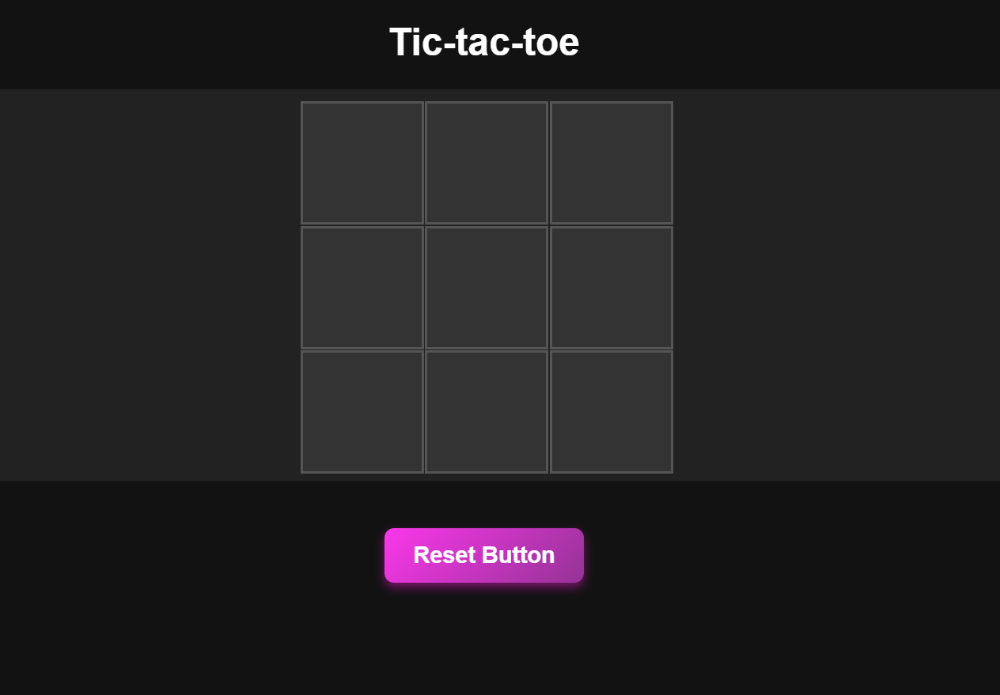

# Tic-tac-toe

A simple Tic-Tac-Toe game with a working demo.

## 📷 Project Screenshot

## 🚀 Demo

https://neocorpse.github.io/moringa-tic-tac-toe

## 🛠️ Installation Steps:

1. Clone the repository:

`https://github.com/NeoCorpse/moringa-tic-tac-toe`

2. Navigate to the project directory:

`cd moringa-tic-tac-toe`

3. Run the game:

Open the index.html file on your browser to run the game
